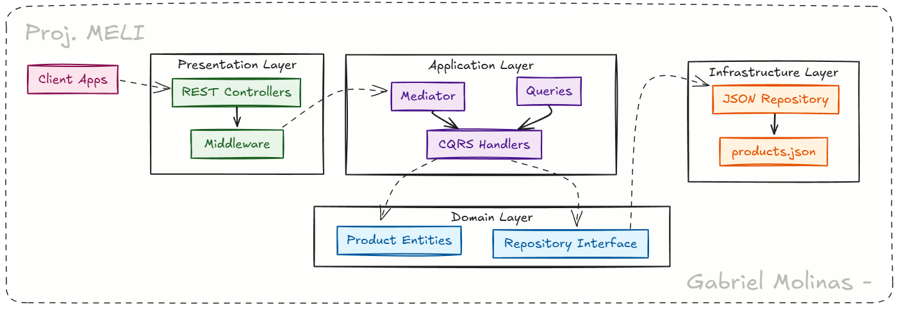

# API de Comparación de Productos

## Descripción

API REST desafío MELI, diseñada para la comparación de productos, implementada siguiendo los principios de **Clean Architecture** con los patrones **Mediator** y **CQRS**. La aplicación proporciona endpoints eficientes para consultar, buscar y comparar información detallada de productos.

## Arquitectura

El proyecto implementa **Clean Architecture** organizando el código en capas bien definidas que garantizan la separación de responsabilidades y el desacoplamiento:

```
meli-products-api/
├── cmd/api/                         # Punto de entrada de la aplicación
├── domain/                          # Entidades de dominio y reglas de negocio
├── internal/
│   ├── delivery/rest/               # Capa de presentación (HTTP/REST)
│   │   ├── controllers/             # Controladores HTTP que manejan requests
│   │   └── middleware/              # Middleware para logging, CORS, seguridad
│   ├── application/                 # Capa de aplicación (lógica de negocio)
│   │   ├── controllers/product/     # Handlers específicos de productos (CQRS)
│   │   ├── queries/product/         # Definiciones de queries
│   │   └── mediator/                # Implementación del patrón Mediator
│   └── repository/                  # Capa de acceso a datos
│       └── json/                    # Implementación de repositorio con JSON
├── pkg/response/                    # Paquetes compartidos para respuestas HTTP
├── data/                           # Datos de prueba (products.json)
└── docs/                           # Documentación Swagger y assets
    └── images/                     # Imágenes para documentación
```

## Patrones de Diseño Implementados




---

### Clean Architecture
La aplicación está estructurada siguiendo los principios de Clean Architecture:

- **Capa de Dominio**: Contiene las entidades de negocio (`Product`, `Specification`) y las interfaces de repositorio
- **Capa de Aplicación**: Implementa los casos de uso mediante handlers que procesan queries específicas
- **Capa de Infraestructura**: Maneja la persistencia de datos (repositorio JSON) y la presentación web (controladores REST)
- **Inversión de dependencias**: Las capas internas no conocen las externas, garantizando flexibilidad

### Patrón Mediator
Implementado para desacoplar los controladores HTTP de la lógica de negocio:

```go
// Los controladores envían queries através del mediator
result, err := pc.mediator.Send(c.Request.Context(), query)
```

**Beneficios**:
- Reduce el acoplamiento entre controladores y handlers
- Facilita la adición de nuevas funcionalidades
- Centraliza el manejo de requests y routing interno

### CQRS (Command Query Responsibility Segregation)
Separación clara entre operaciones de lectura (queries):

```go
type GetProductQuery struct {
    ID string `json:"id" validate:"required"`
}

type SearchProductsQuery struct {
    Query string `json:"query" validate:"required"`
}
```

**Beneficios**:
- Optimización independiente de operaciones de lectura
- Modelos de datos especializados para cada operación
- Escalabilidad mejorada

### Repository Pattern
Abstracción de acceso a datos mediante interfaces:

```go
type ProductRepository interface {
    GetByID(id string) (*Product, error)
    GetAll(category string, minPrice, maxPrice float64) ([]*Product, error)
    // ...
}
```

## Características Técnicas

- **Clean Architecture**: Separación clara de responsabilidades por capas
- **Patrón Mediator**: Desacoplamiento entre controladores y lógica de negocio
- **CQRS**: Separación y optimización de queries de lectura
- **Repository Pattern**: Abstracción de acceso a datos
- **Dependency Injection**: Inyección de dependencias para testabilidad
- **Swagger/OpenAPI**: Documentación automática de API
- **Manejo de errores estructurado**: Respuestas consistentes con códigos HTTP apropiados
- **Middleware completo**: CORS, logging, recovery, headers de seguridad
- **Validación robusta**: Validación de entrada en múltiples niveles
- **Health Check**: Endpoint de monitoreo de salud del servicio

## Endpoints de la API

La API proporciona los siguientes endpoints organizados por funcionalidad:

### Gestión de Productos

#### `GET /api/v1/products`
Obtiene todos los productos con filtros opcionales.

**Parámetros de consulta**:
- `category` (opcional): Filtrar por categoría (ej: "Smartphones")
- `min_price` (opcional): Precio mínimo 
- `max_price` (opcional): Precio máximo

**Ejemplo**:
```bash
GET /api/v1/products?category=Smartphones&min_price=1000&max_price=1500
```

#### `GET /api/v1/products/{id}`
Obtiene un producto específico por su ID.

**Parámetros**:
- `id` (path): ID único del producto

**Ejemplo**:
```bash
GET /api/v1/products/PHONE001
```

#### `GET /api/v1/products/search`
Busca productos por nombre, descripción, marca o categoría.

**Parámetros de consulta**:
- `q` (requerido): Término de búsqueda (mínimo 2 caracteres)

**Ejemplo**:
```bash
GET /api/v1/products/search?q=Samsung Galaxy
```

#### `GET /api/v1/products/compare`
Compara múltiples productos para análisis detallado.

**Parámetros de consulta**:
- `ids` (requerido): IDs de productos separados por comas (2-10 productos)

**Ejemplo**:
```bash
GET /api/v1/products/compare?ids=PHONE001,PHONE002,PHONE003
```

### Metadatos del Sistema

#### `GET /api/v1/categories`
Obtiene todas las categorías disponibles en el sistema.

#### `GET /api/v1/brands`
Obtiene todas las marcas disponibles en el sistema.

### Sistema y Monitoreo

#### `GET /api/v1/health`
Endpoint de verificación de salud del servicio.

**Respuesta**:
```json
{
  "success": true,
  "data": {
    "status": "healthy",
    "timestamp": "2024-01-15T10:30:00Z",
    "service": "meli-products-api",
    "version": "1.0.0"
  }
}
```

#### `GET /swagger/index.html`
Documentación interactiva Swagger UI de la API.

### Imagen de Demostración


*Nota: Las imágenes de demostración se encuentran en la carpeta `docs/images/`*

## Instalación y Ejecución

### Requisitos Previos
- **Go 1.21** o superior
- **Swag CLI** (para generación de documentación Swagger)

### Opción 1: Setup Automático (Recomendado)

**Windows (CMD)**:
```cmd
cd C:\repoDisco\Proyecto_Meli
setup.bat
```

**Windows (PowerShell)**:
```powershell
cd C:\repoDisco\Proyecto_Meli
.\setup.ps1
```

### Opción 2: Setup Manual

```bash
# 1. Navegar al directorio del proyecto
cd C:\repoDisco\Proyecto_Meli

# 2. Descargar e instalar dependencias
go mod tidy
go mod download

# 3. Instalar Swag CLI para documentación
go install github.com/swaggo/swag/cmd/swag@latest

# 4. Generar documentación Swagger
swag init -g cmd/api/main.go -o docs/ --parseDependency --parseInternal

# 5. Ejecutar la aplicación
go run cmd/api/main.go
```

### Solución de Problemas

Si encuentras errores de dependencias:
```bash
go clean -modcache
go mod tidy
go mod download
```

**URLs de acceso**:
- API: `http://localhost:8080`
- Documentación Swagger: `http://localhost:8080/swagger/index.html`

### Comandos Make Disponibles

El proyecto incluye un Makefile con comandos útiles:

```bash
make build      # Compilar la aplicación
make run        # Ejecutar la aplicación
make swagger    # Generar documentación Swagger
make test       # Ejecutar suite de tests
make clean      # Limpiar archivos generados
make help       # Mostrar ayuda de comandos
```

## Ejemplos de Uso

### Consulta de Producto Individual
```bash
curl -X GET "http://localhost:8080/api/v1/products/PHONE001" \
  -H "Accept: application/json"
```

### Búsqueda de Productos
```bash
curl -X GET "http://localhost:8080/api/v1/products/search?q=Samsung" \
  -H "Accept: application/json"
```

### Comparación de Productos
```bash
curl -X GET "http://localhost:8080/api/v1/products/compare?ids=PHONE001,PHONE002,PHONE003" \
  -H "Accept: application/json"
```

### Filtrado Avanzado
```bash
curl -X GET "http://localhost:8080/api/v1/products?category=Smartphones&min_price=1000&max_price=1500" \
  -H "Accept: application/json"
```

## Estructura de Respuesta

Todas las respuestas de la API siguen un formato estándar para garantizar consistencia:

```json
{
    "success": true,
    "message": "Request completed successfully",
    "data": { 
        // Contenido específico de la respuesta
    },
    "error": null,
    "meta": {
        "timestamp": "2024-01-15T10:30:00Z",
        "request_id": "req-12345-abcde",
        "version": "v1"
    }
}
```

### Respuesta de Error
```json
{
    "success": false,
    "message": "Product not found",
    "data": null,
    "error": {
        "code": "PRODUCT_NOT_FOUND",
        "message": "Product with ID 'INVALID001' not found",
        "details": "Please check the product ID and try again"
    },
    "meta": {
        "timestamp": "2024-01-15T10:30:00Z",
        "request_id": "req-67890-fghij",
        "version": "v1"
    }
}
```

## Modelo de Datos

### Entidad Product
```json
{
    "id": "PHONE001",
    "name": "Samsung Galaxy S24 Ultra",
    "image_url": "https://images.samsung.com/galaxy-s24-ultra.jpg",
    "description": "El smartphone más avanzado de Samsung con tecnología de cámara IA",
    "price": 1299.99,
    "rating": 4.6,
    "category": "Smartphones",
    "brand": "Samsung",
    "available": true,
    "specifications": [
        {
            "name": "Pantalla",
            "value": "6.8",
            "unit": "pulgadas"
        },
        {
            "name": "Memoria RAM",
            "value": "12",
            "unit": "GB"
        }
    ]
}
```

### Entidad Specification
```json
{
    "name": "Procesador",
    "value": "Snapdragon 8 Gen 3",
    "unit": ""
}
```

## Testing

Para ejecutar la suite de tests:

```bash
# Usando Make
make test

# Directamente con Go
go test ./...

# Con cobertura de código
go test -cover ./...

# Tests específicos
go test ./internal/application/controllers/product/
```

## Documentación

### Swagger UI
Documentación interactiva disponible en:
`http://localhost:8080/swagger/index.html`

### Generación de Documentación
```bash
# Regenerar documentación Swagger
make swagger

# O manualmente
swag init -g cmd/api/main.go -o docs/ --parseDependency --parseInternal
```

## Desarrollo y Contribución

### Estructura de Ramas
- `main`: Rama principal estable
- `develop`: Rama de desarrollo
- `feature/*`: Nuevas funcionalidades
- `fix/*`: Correcciones de bugs

### Proceso de Contribución
1. Fork del repositorio
2. Crear rama específica: `git checkout -b feature/nueva-funcionalidad`
3. Implementar cambios siguiendo los patrones establecidos
4. Escribir/actualizar tests correspondientes
5. Commit con mensaje descriptivo: `git commit -m "feat: agregar endpoint de filtrado avanzado"`
6. Push de la rama: `git push origin feature/nueva-funcionalidad`
7. Crear Pull Request con descripción detallada

### Convenciones de Código
- Seguir las convenciones estándar de Go (gofmt, golint)
- Comentarios en español para documentación de negocio
- Comentarios en inglés para documentación técnica
- Tests unitarios para toda nueva funcionalidad
- Documentación Swagger actualizada

## Licencia

Este proyecto está licenciado bajo **Apache License 2.0**. Ver archivo [LICENSE](LICENSE) para más detalles.

## Soporte y Contacto

**Equipo de Desarrollo**:
- Email: soporte@meli-products.com
- Issues: [GitHub Issues](https://github.com/tu-usuario/proyecto-meli/issues)
- Wiki: [Documentación Técnica](https://github.com/tu-usuario/proyecto-meli/wiki)

---

*Desarrollado con Go utilizando Clean Architecture, Mediator y CQRS*
Gabriel Molinas

---
